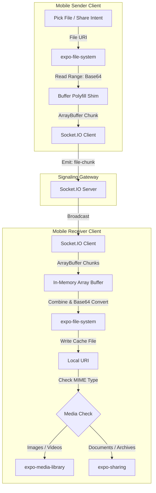

# MangoShare Mobile Application Client

## Overview
This repository contains the mobile client for the MangoShare peer-to-peer styled file sharing ecosystem. Built using React Native and Expo, this application enables high-speed, direct device-to-device transfers. It utilizes the unified MangoShare Socket signaling backend, allowing users to seamlessly transmit files across diverse environments.

### Cross-Platform Capabilities
The mobile client uses the same communication contracts as the web version. This allows direct transfers between:
* Android APK to Web Browser
* Web Browser to Android APK
* Native Mobile to Native Mobile (iOS/Android)

## Project Architecture
The system consists of decoupled applications working in tandem to support multi-device transfers:
1. **MangoShare Web Application (App Repo)**: The client-facing Next.js dashboard containing the user interface, role coordination, FileReader binary chunking pipeline, and local buffer reassembly engine.
   * Repository Link: [https://github.com/vaibhavgupta5/MangoShare-Web](https://github.com/vaibhavgupta5/MangoShare-Web)
2. **MangoShare Mobile Application (Mobile Repo)**: The mobile client built with React Native and Expo, supporting native camera QR scanning, document picking, and system sharing intents.
   * Repository Link: [https://github.com/vaibhavgupta5/MangoShare-Expo](https://github.com/vaibhavgupta5/MangoShare-Expo)
3. **MangoShare Socket Server (Socket Repo)**: A lightweight Node.js/TypeScript server managing logical rooms, enforcing connection limits, and piping binary payloads instantly between senders and receivers.
   * Repository Link: [https://github.com/vaibhavgupta5/MangoShare-Socket](https://github.com/vaibhavgupta5/MangoShare-Socket)

---

## Technical Features

* **Camera-Based QR Code Scanners**: Uses integrated camera hardware to scan generated connection links and automatically extract room codes for instantaneous handshake coordination.
* **Document Picker Integration**: Integrates with native mobile file system pickers to select any file extension or size for transmission.
* **Native OS Sharing Intents**: Handles incoming shared files from other mobile apps (e.g., Photos, Files) through deep linking, automatically routing them to the transmission screen.
* **Smart Media Destination Routing**: Automatically saves incoming image and video files directly to the device's photo gallery, falling back to the native OS share sheet for documents, archives, and spreadsheets.
* **Native Completion Notifications**: Schedules local OS notifications on transfer completion, letting users open or share downloaded files immediately.

---

## Mobile Architecture and Advanced Logic

Since React Native executes JavaScript in a sandboxed environment separate from the native OS file layer, standard browser features like `FileReader` or direct filesystem buffers are not available. MangoShare implements several specialized workflows to bridge this gap:

### 1. Bridge-Safe Base64 Chunk Slicing
Loading a large file (e.g., 50MB+) entirely into React Native's JavaScript engine causes memory exhaustion and application crashes. The app implements sequential segment reading:
* Slices are read directly from device storage at the native layer using `expo-file-system`.
* The API reads precise ranges using `position` and `length` arguments:
  ```typescript
  const chunkBase64 = await FileSystem.readAsStringAsync(fileUri, {
    encoding: "base64",
    position: offset,
    length: chunkSize
  });
  ```
* This keeps the memory footprint flat, ensuring stable transfers regardless of the total file size.

### 2. Polyfilled ArrayBuffer Serialization
React Native lacks a native Node.js `Buffer` environment. To prepare Base64 string data for binary transmission over Socket.IO:
* A polyfill buffer shim transforms the Base64 segment into an `ArrayBuffer` payload:
  ```typescript
  const chunk = Buffer.from(chunkBase64, "base64").buffer;
  ```
* The raw ArrayBuffer is dispatched through the socket, preserving the byte-stream protocol expected by the signaling server.

### 3. Progressive Buffer Reassembly & Gallery Sync
Upon receiving chunks:
* Individual `ArrayBuffer` segments are stored in a local array list.
* When progress hits 100%, the segments are concatenated at the byte level and written to the application's secure cache directory:
  ```typescript
  const combined = new Uint8Array(totalLength);
  // ... chunk merging sequence ...
  const base64 = Buffer.from(combined).toString("base64");
  await FileSystem.writeAsStringAsync(localCacheUri, base64, { encoding: "base64" });
  ```
* If the file is an image or video, the app requests permission via `expo-media-library` to move it into the device's persistent gallery. Otherwise, it triggers `expo-sharing` to delegate file access to the user's preferred native app.

---

## Data Routing Workflow

The diagram below details the data flow on the mobile client:



---

## Tech Stack
* **Runtime**: Expo (SDK 54) / React Native (0.81)
* **Real-Time Client**: Socket.io-client (v4)
* **Design & Styling**: React Native StyleSheets, Expo Linear Gradient, Lucide React Native Icons
* **Camera & Hardware**: `expo-camera` (QR Scanning)
* **File System Operations**: `expo-file-system`, `expo-document-picker`, `expo-sharing`, `expo-media-library`
* **Buffer Utility**: `buffer` shim
* **Type System**: TypeScript

---

## Getting Started

### Prerequisites
* Node.js (v18 or higher)
* Android Studio Emulator or physical device with **Expo Go** installed.

### Setup and Running
1. Navigate to the mobile project root directory:
   ```bash
   cd mobile
   ```
2. Install the node packages:
   ```bash
   npm install
   ```
3. Create a `.env` configuration file and specify your Socket server URL:
   ```env
   EXPO_PUBLIC_SOCKET_URL=https://mangoshare-socket.onrender.com
   ```
4. Start the Expo development server:
   ```bash
   npm run start
   ```
5. Scan the terminal's QR code using the Expo Go application (Android) or the native Camera app (iOS) to launch the application.

### Compilation / Build (EAS CLI)
To compile a standalone Android APK or iOS binary, use EAS Build:
```bash
eas build --platform android --profile preview
```
Make sure your credentials and configure settings in `eas.json` are setup correctly prior to building.
